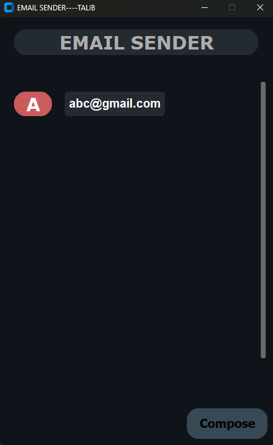
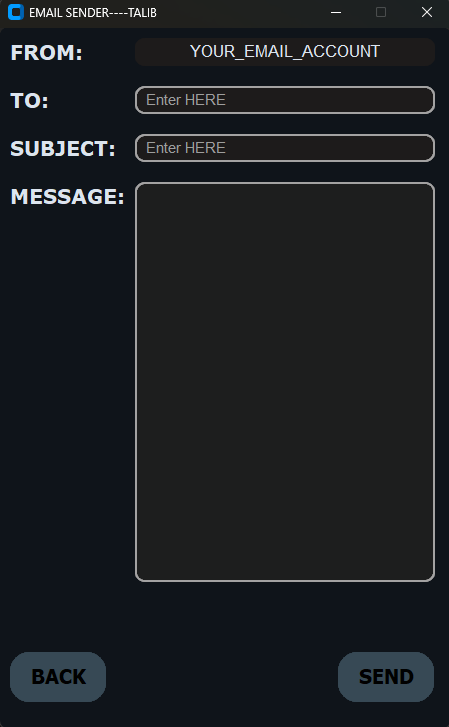
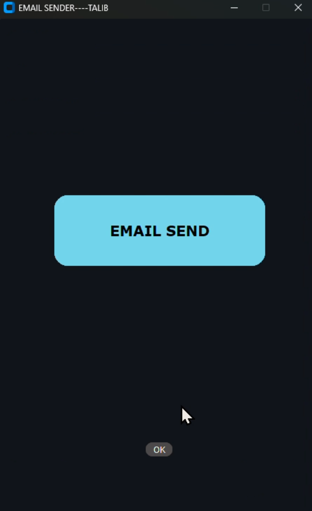
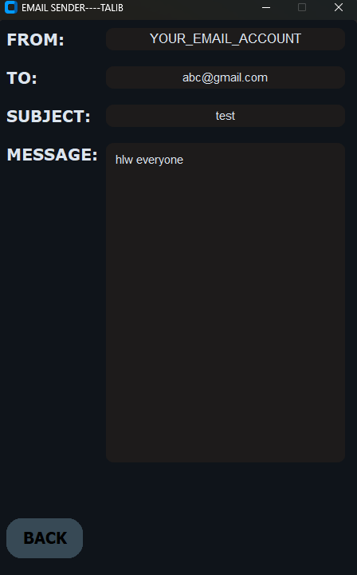

## Email Sender Desktop Application
`Description`
- This is a Python-based desktop email sender application built using CustomTkinter.
The application allows users to compose emails, send them using Gmail SMTP, and view the history of sent emails with full message details.

The project focuses on building a real-world GUI application with proper state management, data persistence, and user-friendly design.

------------------------------------------------------------------------------

## Features:
- Compose and send emails using Gmail SMTP.
- Multi-page UI (Home, Compose, Sent Confirmation, Email View).
- Stores sent email history using JSON files.
- View previously sent emails with subject and full message.
- Auto-refresh email history without restarting the app.
- Clears compose form after successful email send.
- Scrollable email content for long messages.
- Clean and modern UI using CustomTkinter.

------------------------------------------------------------------------------

## Preview
<p aling="center">
    
    
    
    
</p>

------------------------------------------------------------------------------

## Technologies Used:
- Python 3
- CustomTkinter (GUI)
- smtplib & EmailMessage (Email sending)
- JSON (Data storage)

------------------------------------------------------------------------------

## How It Works:
`1.` User composes an email on the Compose page.
`2.` Email is sent using Gmail SMTP.
`3.` Sent email details are stored in JSON files.
`4.` The application automatically refreshes the sent email history.
`5.` Clicking on any email opens a detailed view of that email.

------------------------------------------------------------------------------

## Installation & Run:

### 1. Clone the repositry
```bash
git clone https://github.com/TALIBKHAN-hub/SIMPLE---GUI---CALCULATOR.git
cd SIMPLE---GUI---CALCULATOR
```

### 2. Install dependencies
```bash
pip install customtkinter
```

### 3. Run the application
```bash
python Calculator.py
```

`Make sure you enable App Password in Gmail and update the email credentials in the code.`

------------------------------------------------------------------------------

## Challenges Faced & Solutions:
- `Email history not updating:`
  Solved by dynamically refreshing UI widgets after sending emails.
- `Old data appearing in compose page:`
  Fixed by clearing input fields after successful email sending.
- `Long email messages breaking UI:`
  Solved by replacing labels with scrollable textboxes.
- `Delayed data loading in email view page:`
  Fixed by updating label content dynamically instead of loading at initialization

------------------------------------------------------------------------------

## Future Improvements:
- Add attachments support
- Add search and filter for sent emails
- Improve UI responsiveness
- Add login system
- Encrypt stored email data

------------------------------------------------------------------------------

## Author:
`MADE BY TALIB`